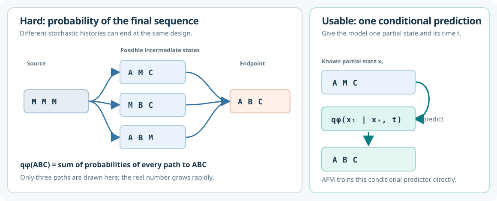

# Active Flow Matching — visual reading guide

**Paper:** Yashvir S. Grewal et al., *Active Flow Matching* (arXiv:2603.00877v1, March 2026), [full text](https://arxiv.org/html/2603.00877). The arXiv record lists it as a preprint; no accepted venue is listed there.

**Visuals:** [[Active Flow Matching - visual explanation.excalidraw]] · [Animated explainer](../Teaching/reference/active-flow-matching-visual-explainer.html)

## The problem

Online design starts with measured pairs \((x,y)\), proposes a batch of new discrete designs, spends an expensive oracle budget to score them, and repeats. The goal is to find designs above a high-fitness threshold \(\tau\) while preserving enough diversity to keep exploring (§2.1).

Imagine generating a sequence by starting with masks and gradually filling them in. At each step, the model can use the **whole partial sequence** to decide what every position should become. Several different routes can reach the same finished sequence.



In the diagram, **M** means a masked (unknown) position; **A**, **B**, and **C** stand in for sequence tokens. The left side shows why \(q_\phi(x)\), the probability of a *finished* sequence, is hard to calculate: we would have to add the probabilities of **all** routes to it, not just the three drawn. The right side shows the easier question the model can answer: given **one** partial sequence \(x_t\) at time \(t\), what finished sequence \(x_1\) does it predict? Standard CbAS and VSD need the hard final probability or its gradient; AFM uses the conditional prediction instead (§§1, 2.2–3.1).

## The paper's central move

The flow *does* give a tractable prediction of the completed endpoint from an intermediate state: \(q_\phi(x_1\mid x_t,t)\). AFM moves the optimization objective onto these conditional endpoint distributions along the flow path. For forward-KL AFM, this becomes a fitness-weighted denoising or cross-entropy loss (§§3.1–3.2).

Think of the target as favoring designs under the prior that have a high estimated chance of meeting the threshold:

\[
p^*(x) \propto p_{\mathrm{prior}}(x)\,P(y\geq\tau\mid x).
\]

The paper's forward-KL consistency theorem says that, under its stated masked-source and path assumptions and at the global optimum of the objective, the learned terminal distribution matches this target almost everywhere (Theorem 3.1). This is an asymptotic/model-optimum statement, not a guarantee for finite data, imperfect classifiers, or a finite oracle budget.

## Follow one online round

1. **Collect labels.** Keep the measured dataset \(D_r=\{(x,y)\}\). Train a classifier that estimates \(P(y\geq\tau\mid x)\) (§3.1).
2. **Choose a proposal source.** AFM mixes a broad prior, the previous flow, and a replay buffer of high-scoring observed designs. In the practical implementation, a component is selected and the full training minibatch is drawn from it (§3.5).
3. **Correct and emphasize.** Self-normalised importance weights account for the proposal source and emphasize likely high-fitness designs. Sample a flow time \(t\), corrupt each endpoint \(x_1\) to an intermediate \(x_t\), and form the weighted conditional training loss (Eq. 10, Algorithm 1).
4. **Update the active flow.** Take gradient steps on the conditional endpoint network \(q_\phi(x_1\mid x_t,t)\). This does not require a gradient through the expensive fitness oracle or an exact \(q_\phi(x)\) (Algorithm 1).
5. **Generate and measure.** Sample a new batch from the updated flow, ask the external oracle for its scores, add those observations to \(D_{r+1}\), and repeat (§2.1, Algorithm 1).

The paper also derives reverse-KL and symmetric-KL versions. It does **not** prove the same terminal-distribution consistency result for the reverse-KL variant (§§3.3–3.4).

## Why there are three endpoint sources

Section 3.5 defines the training proposal as a mixture:

\[
\mu_r(x_1)=\alpha_0p_0(x_1)+\alpha_{\mathrm{flow}}q_1^\theta(x_1)
+\alpha_{\mathrm{replay}}\sum_{j=1}^{J}\pi_j\,\delta_{x^{(j)}}(x_1),
\qquad \sum_c\alpha_c=1.
\]

The \(\alpha\)'s choose *how often* each source is used. The \(\pi_j\)'s choose *which stored design* is replayed, with \(\pi_j\propto\exp(\gamma y_j)\) in the paper. In the practical implementation, the algorithm selects one source for a training minibatch and draws the whole minibatch from it. These endpoint samples train the active flow. They are distinct from the later batch generated by the updated flow for expensive oracle evaluation (§3.5).

| Source | What it samples | Why it is useful | Main cost or risk |
| --- | --- | --- | --- |
| **Prior** \(p_0\) | Broad sequences, uniform in the paper's mixture definition | Preserves coverage and can discover regions the current model misses | High-fitness designs are rare, so many draws carry little useful signal |
| **Previous flow** \(q_1^\theta\) | Endpoints from a frozen earlier or lagging flow | Refines regions that learned generation already reaches | May neglect unseen regions; its endpoint density must be estimated by Monte Carlo (§§3.1, 3.5) |
| **Replay** \(\sum_j\pi_j\delta_{x^{(j)}}\) | Designs with observed scores above the threshold | Reuses confirmed successes with low uncertainty about whether they passed \(\tau\) | Cannot create a new endpoint on its own; overuse can narrow search |

### Does “prior” mean starting from random tokens?

**For the three-source training mixture, yes: choose a random *complete* endpoint \(x_1\).** The paper defines this proposal prior as uniform over sequences (§3.5). For a toy alphabet \(\{A,B,C\}\) and length 3, it might draw `BAC`, `CCA`, or `ABB`; each of the \(3^3\) sequences has probability \(1/27\). In a protein alphabet with 20 choices per position, the same idea gives a random length-\(L\) sequence. These draws need not be good designs. The high-fitness classifier assigns each a probability of passing \(\tau\), and low-probability draws get low weight during training (Eq. 18).

```text
Training when the prior source is selected:
random complete endpoint x₁ = B A C
                      ↓ sample an intermediate time and mask/corrupt it
partial state         xₜ = B M C
                      ↓ train the model to predict the endpoint
target                         B A C
```

This is different from the **flow's starting state** \(x_0\) during generation. A standard masked flow can start from `M M M` and iteratively reveal tokens; the background also describes a uniform-random-token source (§2.2). In the FoldX experiment, the source \(x_0\) is drawn from the replay buffer instead, to restrict the flow to local mutations (Appendix A.3). So “random complete sequence used to train this round” and “initial state from which the flow generates” are two separate choices. The search also begins with an initial measured dataset \(D_0\); it is not built entirely from scratch using unscored random sequences (§2.1).

### Why the weights differ: a short derivation

Write \(s(x)=P(y\geq\tau\mid x)\) and the unnormalised target as \(\tilde p(x)=p_0(x)s(x)\). If endpoints are drawn from a proposal \(\mu\), the ordinary importance weight is \(w(x)=\tilde p(x)/\mu(x)\). For any statistic \(h\), assuming the proposal covers the target support,

\[
\frac{\mathbb E_{x\sim\mu}[w(x)h(x)]}{\mathbb E_{x\sim\mu}[w(x)]}
=\frac{\sum_x p_0(x)s(x)h(x)}{\sum_x p_0(x)s(x)}
=\mathbb E_{x\sim p^*}[h(x)].
\]

This is the reason to correct for the proposal: sampling more often from a convenient source should not, by itself, change the intended target. AFM uses a finite, self-normalised version of this calculation to weight its conditional endpoint loss (Eq. 10).

- **Prior minibatch:** setting \(\mu=p_0\) cancels the prior exactly, so \(w(x)=s(x)\) (Eq. 18).
- **Previous-flow minibatch:** with the paper's uniform prior, the constant prior factor cancels after normalisation, leaving weights proportional to \(s(x)/q_1^\theta(x)\). The flow density is approximated by Monte Carlo over source draws (Eqs. 19–20, §3.5).
- **Replay minibatch:** for previously verified high-fitness designs, \(s(x^{(j)})\) is treated as 1. The formal weight on stored design \(j\) is proportional to \(p_0(x^{(j)})/\pi_j\) (Eq. 21). Equal normalised weights follow when those ratios are equal, such as when \(\pi_j\propto p_0(x^{(j)})\). **The paper also says its practical replay sampling uses \(\pi_j\propto e^{\gamma y_j}\) and sets replay weights to 1.** Those choices do not generally satisfy the exact equal-weight condition. Treat unity replay weights as the described implementation choice, not a universal algebraic identity (§3.5). A replay-only proposal also lacks support outside stored designs, so the global importance-sampling identity above requires broader proposal coverage.

In the Ehrlich experiments, the schedule starts mostly with prior draws. Replay probability grows as \(\min(0.4,0.05r)\); once the replay buffer is larger than the batch, the flow takes about 95% of the *remaining non-replay probability*, with the prior getting the remainder. This shifts from discovery toward refinement. The FoldX and AAV tasks use different mixture schedules, so these coefficients are experiment-specific (Appendix A.2–A.4).

## What the experiments support

| Setting | Reported result | Qualification |
| --- | --- | --- |
| Ehrlich synthetic landscapes, lengths 32 and 64 | Forward-KL AFM converged fastest toward near-optimal designs; symmetric-KL was close behind (§5.3). | These are controlled, sequence-based synthetic objectives with known optima. |
| AAV capsid sequence design | Forward- and symmetric-KL AFM achieved the lowest regret in the reported comparison (§5.3). | The fitness oracle is a supplied CNN model, not a wet-lab assay in this experiment (§5.1). |
| FoldX protein stability | Forward-KL AFM found high-stability variants fastest among compared methods (§5.3). | The mutation-constrained run uses a small batch of eight per round (§5.1). |
| FoldX solvent-accessible surface area | Forward-KL AFM **underperformed VSD and CbAS** (§5.3). | This is a clear counterexample to a blanket “AFM wins” claim. |
| F2 molecular docking | Forward-KL AFM found higher scores than VSD across the reported optimization (§5.3). | The authors could not stabilise CbAS on this task, so that comparison is absent (§5.1). |

For Ehrlich and AAV, the metric is simple regret against a known optimum. For FoldX and docking, it is the best score found. Most reported results average five independent runs; Dockstring uses three (§5.1).

## Limits that matter for this project

- **Classifier quality:** Early rounds have few labels, so \(P(y\geq\tau\mid x)\) may be wrong. AFM's steering depends on it (§6).
- **Proposal overlap:** Importance sampling can have high finite-sample variance when sampled designs poorly overlap the high-fitness target. The three-source proposal is part of the method, not an incidental detail (§§3.5, 6).
- **Variant choice:** Forward-KL was more reliable in the reported tests; reverse-KL was more mode-seeking and lacks the same consistency proof (§§3.3, 5.3, 6).
- **Domain transfer:** The experiments cover protein and molecule design. They do not establish performance on Pokémon team search.

## A Pokémon adaptation to test, not assume

Represent a legal team as a structured discrete sequence; treat battle outcomes against a defined opponent distribution as the expensive oracle; and fit a high-fitness classifier using measured team results. A flow would need to learn valid multi-slot interactions, while an external legality checker would record and reject invalid samples. Repeated battles and independent re-evaluation would be needed to distinguish search progress from match noise.

Compare forward-KL AFM against the project's random, copy-and-mutate, OPRO-style, and diffusion candidate proposers using matched battle budgets. Record training cost, accepted and rejected proposals, unique legal teams, diversity among strong teams, and held-out win rate. This is an experimental proposal derived from the paper's method, not a result reported by its authors.
