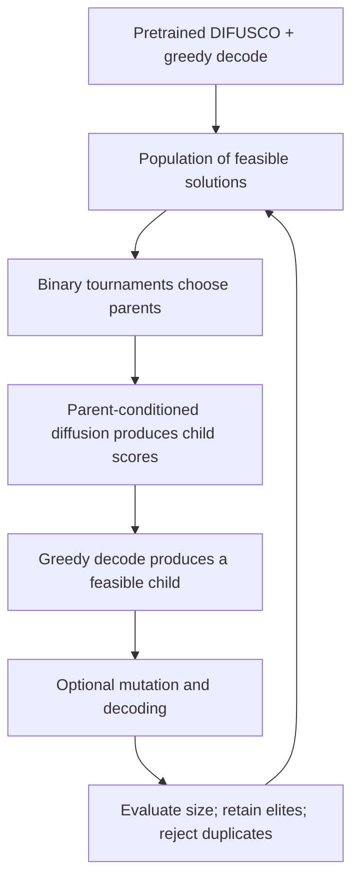

# DDEA: follow one child from its parents to the next generation

The paper is **A Denoising Diffusion-Based Evolutionary Algorithm Framework: Application to the Maximum Independent Set Problem**, by Joan Salvà Soler and Günther R. Raidl. This walkthrough uses the October 2025 arXiv preprint. The proceedings chapter appeared in 2026.

**The central idea:** train diffusion to imitate a strong, expensive crossover operator, then use that trained operator repeatedly inside an evolutionary search. A second diffusion role supplies the initial population. The population changes during search; the pretrained model weights remain fixed.

## 1. What is being optimized?

An independent set contains nodes with no edges between them. Fitness is the number of selected nodes. Feasibility and fitness are different: a valid set of size 3 may lose to another valid set of size 4.

For this invented six-node example, the edges are **B–E, C–D, B–F, D–F, B–D**. Node A is isolated. Encode a solution as six bits in the order A, B, C, D, E, F.

| Candidate | Bits | Size | Valid? |
|---|---|---:|---|
| Parent x = {A, B, C} | 111000 | 3 | Yes |
| Parent y = {A, D, E} | 100110 | 3 | Yes |
| Union = {A, B, C, D, E} | 111110 | 5 | No: it contains conflicting pairs |
| Child z = {A, C, E, F} | 101011 | 4 | Yes |

The interesting child includes F, which **neither parent selected**. DDEA's expert is allowed to do more than choose each bit from one parent.

## 2. How does the expert choose a child?

The teacher solves an integer linear program: maximize the child's selected-node count, obey every graph constraint, and obey a distance limit:

`h(z,x) + h(z,y) <= lambda * h(x,y)`

Here `h` counts differing bits. The parents disagree at B, C, D and E, so `h(x,y) = 4`. With the paper's `lambda = 1.75`, the budget is `7`.

For z = {A, C, E, F}:

- It differs from x at B, E and F: distance 3.
- It differs from y at C, D and F: distance 3.
- Total distance 6 is within budget 7, and size 4 beats both parents' size 3.

**Why the parameter matters:** every parental disagreement contributes exactly 1 to the total distance, whichever bit the child chooses. Changing a bit where both parents agree costs an additional 2. Thus `lambda = 1` preserves all parental agreements; `lambda = 1.75` permits one agreement flip in this example. That lets F enter. At lambda 1, the best allowed size is 3; at lambda 1.75, it is 4. These toy results can be verified by checking all 64 subsets.

This hard distance limit belongs to the **teacher's ILP**. The learned diffusion model is trained on its outputs; the paper's greedy decoder does not enforce the same distance bound on every generated child.

## 3. What does diffusion learn?

Offline, an evolutionary algorithm invokes the expensive teacher on parent pairs. It stores examples `(graph, parent x, parent y, expert child)`.

During training, corrupt the expert child with noise and train the model to denoise it while seeing the graph and both parents. The experiments use Gaussian diffusion. At generation time, begin with fresh noise and denoise while conditioning on the selected parents. The parents are context; the method is not simply adding noise to one parent and restoring it.

The paper uses about 160,000 recombination demonstrations. Expert ILP calls have a 15-second limit, so a label can be a strong feasible solution without being proven optimal. The exact enumeration in the interactive toy is only a teaching substitute for that ILP, not a diffusion simulation.

## 4. What happens during evolutionary search?

The greedy decoder visits nodes in descending score order. It selects an eligible node and excludes its neighbors. This guarantees an independent set, not a maximum independent set. For example, prioritizing A, C, E, F yields the size-4 child above; prioritizing A, B, C can produce the valid but smaller parent x.

The standard mutation stage perturbs selected nodes and decodes a modified random score vector. Mutation is separate from the diffusion crossover. In the paper, mutation probability is 0.1 and the per-selected-node deselection probability is 0.05.

## 5. How to read the evidence

**Table 1:** how well does learned crossover approximate the expert? Parent quality matters; weak parents do not automatically become excellent offspring.

**Table 2:** separate diffusion initialization from diffusion recombination using ablations. Inspect both quality and time: this table contains different generation counts and runtimes, so its rows should not all be treated as exact equal-budget comparisons. Some adjacent prose also gives values differing from the displayed table.

**Figure 2 and Section 4.4:** compare the full search against DIFUSCO over runtime budgets. These experiments evaluate MIS, not noisy black-box battle objectives.

## 6. The useful distinction for your project

Your CEM experiments improve a **generator distribution** by selecting evaluated teams and retraining. DDEA's inference loop improves a **population of solutions** using fixed, pretrained generative operators. This is a different role for diffusion.

A possible adaptation would condition a generator on two teams and use it to propose offspring inside evolutionary search. That requires parent-pair/child training examples, meaningful alignment of unordered teams, legal decoding, and reliable battle evaluation. DDEA supplies neither an expert for battle strength nor evidence that this adaptation will help. Treat the missing teacher as a substantial requirement, not an implementation detail.

## Check your understanding

1. Why is the union of the parents not automatically a good child?
2. How can the child select a node absent from both parents?
3. What changes during search: the population, the diffusion weights, or both?
4. What enforces graph feasibility, and does it enforce the teacher's distance limit too?

Answers

1. The parents are each feasible, but their union can contain adjacent selected nodes.
2. The teacher allows deviations from parental agreements when its distance budget permits them; training examples can therefore contain such children.
3. The population changes; model weights stay fixed during the described search.
4. Greedy decoding enforces graph feasibility. It does not enforce the teacher's combined Hamming-distance limit.

Sources: [paper, Sections 3–4](https://arxiv.org/html/2510.08627v1), [authors' implementation](https://github.com/jsalvasoler/difusco_ddea), [proceedings record](https://www.ac.tuwien.ac.at/publications/soler-26).
