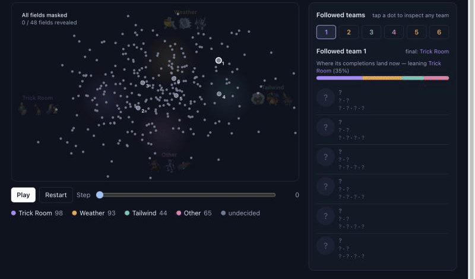

# Battle Factory of Porygon-Pi

[](LICENSE)
[](code/README.md)

Searching the space of competitive Pokémon VGC teams (Champions Reg Set M-B) for teams that beat a meta, using a diffusion proposer, a battle simulator and a surrogate.

**Result (2026-10-08).** The best team the search found wins 0.667 of simulated battles against the 50 top-placing meta teams, within noise of the best real team (0.691, standard error about 0.03). Across the 16 best finalists the average is 0.581, so the search reaches the level of real teams but has not beaten them.

*Win rate = wins ÷ battles against those 50 teams, one battle per pairing, with the same behaviour-cloned battle policy piloting both sides. A top-50 team scores 0.531 against the other 49. Source: [`code/docs/cem-v3-loop.md`](code/docs/cem-v3-loop.md).*

[](https://rami-ismael.github.io/Battle-Factory-of-Porygon-Pi/notes/Blog/visuals/archetype-diffusion/archetype-diffusion.html)

**[Try it live](https://rami-ismael.github.io/Battle-Factory-of-Porygon-Pi/notes/Blog/visuals/archetype-diffusion/archetype-diffusion.html):** scrub through the 48 decoding steps and click any dot. Each dot is a team from the diffusion proposer. The figure shows what the model generates, not how well those teams play.

| Folder | What it is |
| --- | --- |
| [`notes/`](notes) | The research notes: Markdown, Obsidian-flavoured (`[[links]]`), plus the blog and its interactive figures. |
| [`code/`](code) | The pipeline: team generator, battle runner, search loops, GUI. Start at [`code/README.md`](code/README.md). |
| [`tools/sync.py`](tools/sync.py) | Copies both folders from the author's laptop and pushes. |

## Where the truth lives

The source of truth is the Obsidian vault and the code folder **on the author's laptop**. This repository is a published mirror of them, one-way:

```
Obsidian vault  ──sync──▶  notes/
code folder     ──sync──▶  code/
```

An edit in Obsidian shows up here as the same edit in the next sync. An edit made on github.com is overwritten by that sync, so open a note locally instead.

Ignored files (`.obsidian`, virtual environments, battle results, files over 5 MB) never leave the laptop, so the large datasets under `code/` are not included.

```bash
tools/sync.py --dry-run   # show what would change
tools/sync.py             # mirror, commit, push
```

## Acknowledgements

[Pokémon Showdown](https://github.com/smogon/pokemon-showdown) for the battle simulator, [VGC-Bench](https://github.com/cameronangliss/VGC-Bench) for the behaviour-cloned policy and the scraped teams, and [poke-env](https://github.com/hsahovic/poke-env).
