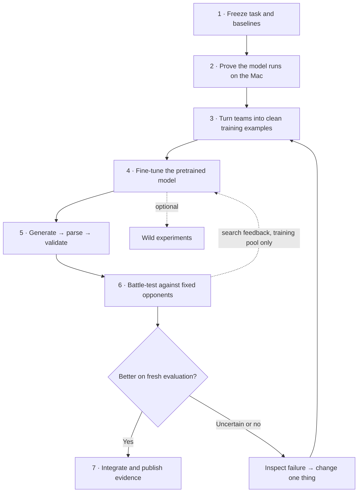

- [ ] Look for a pretrained text diffusion model we can run on my macbook pro
- [ ] Decide what is the structure of the instruction prompt to look like 
- [x] Ask the llm for checkbox items that make sense add for a complete todo list please share wacky ideas please show all your ideas in your head I don't care about compute I have macbook pro and 100 dollar subscription to chatGPT code subscription please keeping go you are highest level of reasoning so I animation and design what you are are planning to do anyway I understnad picture much faster than by words

## Expanded plan — 2026-10-08

**The question:** does starting from a pretrained text diffusion model help us find stronger, legal VGC teams than the current scratch model and cheap search operators?

**First route to investigate:** Fast-dLLM v2 1.5B with a small adapter fine-tune. It is a block diffusion model, so it fills blocks in sequence and tokens within a block in parallel. Keep full-sequence MDLM / LLaDA / Dream as separate experiments when the question requires arbitrary team-wide infilling. A block diffusion result alone does not establish the value of global bidirectional generation.

**Status:** this is a researched plan. No pretrained checkpoint has been downloaded, no fine-tuning has been run, and no new battle result is claimed. The two original tasks above remain open until a model runs here and the prompt passes a real data round-trip.

### The picture



The interactive roadmap in the chat animates these proposed stages. Its token examples are illustrations, not model outputs or evidence of legality.

### What we know before starting

| Evidence | Consequence for this plan |
| --- | --- |
| The machine reports Apple M4 Pro and 24 GiB unified memory. | Measure inference **and backward-pass** memory; weight size alone cannot establish training feasibility. |
| The live project uses `gen9championsvgc2026regmb`. Its core representation is six slots × eight categorical fields: species, ability, item, four moves, nature. | Begin with the existing format and representation. Keep Stat Points handling identical across comparison arms. |
| The current Champions code describes Stat Points rather than ordinary EVs, and no Tera type. | Read the pinned simulator's actual rules. Do not import a generic Scarlet/Violet prompt or stat constraints. |
| The repository README says the vault and `/Users/ramiismael/Documents/code/vgc-team-generator-pilot` are the sources of truth; this checkout is a mirror. | Edit this vault note and use the normal one-way sync later. Do not run the sync-and-push script merely to update the checklist. |

Your ChatGPT/Codex subscription supports the assistant work under its usage limits. Plan usage and API token pricing are distinct; do not treat the subscription as a budget of GPU hours for training arbitrary open weights. Local training runs on the Mac; any external training service needs its own actual resource allocation. [Official OpenAI pricing](https://learn.chatgpt.com/docs/pricing)

### Model shortlist: candidates, not Mac compatibility claims

| Candidate | Why try it | What must be proved |
| --- | --- | --- |
| **[Fast-dLLM v2 1.5B](https://huggingface.co/Efficient-Large-Model/Fast_dLLM_v2_1.5B)** — first pilot | A released 1.54B block diffusion model adapted from Qwen2.5-1.5B-Instruct; a useful scale between the scratch model and 7–8B models. | Inspect custom attention, masking, shifted targets, generation and adapter training on MPS. The card's quickstart names a different model ID; pin the actual v2 checkpoint and matching code rather than copy it blindly. [Author code](https://github.com/NVlabs/Fast-dLLM/tree/main/v2) |
| **[MDLM OpenWebText](https://huggingface.co/kuleshov-group/mdlm-owt)** — small full-sequence comparison | A pretrained text denoiser with a 1,024-token context; the card reports about 130M non-embedding parameters. It is not an instruction assistant. | Its published [implementation](https://huggingface.co/kuleshov-group/mdlm-owt/blob/main/modeling_mdlm.py) imports FlashAttention and uses CUDA paths. A portable attention/rotary implementation needs numerical checks; this is not a ready-made Mac fallback. |
| **[Dream 7B](https://github.com/DreamLM/Dream)** — larger full-sequence experiment | Released generation hooks and fine-tuning code make it interesting for controlled infilling. | Its documented training example uses eight GPUs. That is an example configuration, not a proven minimum; a Mac adapter route still needs to be established. |
| **[LLaDA 8B](https://github.com/ML-GSAI/LLaDA)** — research comparison | Released base/instruct checkpoints and [masked-diffusion SFT guidance](https://github.com/ML-GSAI/LLaDA/blob/main/GUIDELINES.md). | Audit the exact release and training implementation. The original repository supplies guidance rather than its full training framework. Do not assume every later LLaDA variant shares the same code. |

For intuition only, 1.54B parameters × two bytes is about **3.1 GB of weights**; 7B is about 14 GB and 8B about 16 GB. Those estimates omit activations, gradients, optimizer state, temporary buffers and macOS. Quantization may reduce weight storage but does not, by itself, make an architecture trainable on MPS or supported by MLX.

## Complete execution checklist

Each numbered stage ends in a concrete deliverable. Complete the main route before treating the optional experiments as requirements.

### 1. Define success and freeze the comparison

- [ ] **1.1 — Pick the first task:** generate complete teams in the current format, then select against a supplied opponent or weighted opponent pool using the existing evaluator. Add opponent-conditioned fine-tuning only when real opponent–candidate labels exist.
- [ ] **1.2 — Freeze the environment:** record the format ID, simulator commit, legality data, battle-policy checkpoint, opponent pool and weighting, side assignment, tie handling, and evaluation settings in one manifest.
- [ ] **1.3 — Preserve the scratch baseline:** identify the best current checkpoint from recent experiment records, save its config and tokenizer/vocabulary, and run it through the same evaluation path. The README contains historical stages; it is not enough to identify today's best model.
- [ ] **1.4 — Declare the primary outcome:** independently verified battle strength after the same search battle budget. Also report raw legality, unique legal candidates, wall time, peak memory and measured training cost.
- [ ] **1.5 — Separate budgets:** report both equal battle-budget comparisons and equal end-to-end time comparisons; also record proposal counts and fine-tuning effort. A slower generator can win one comparison and lose another.
- [ ] **1.6 — Predeclare a decision rule:** choose the practically useful improvement and uncertainty criterion before opening final results. A lower text loss, a nice explanation or an impressive individual team is insufficient.

**Deliverable:** one frozen experiment manifest and a reproducible baseline run.

### 2. Prove the model can train on this Mac

- [ ] **2.1 — Pin the candidate:** save the exact checkpoint revision, tokenizer, license, model config, custom code revision and compatible package versions. Scout a newer small open diffusion checkpoint if it offers a better documented training path.
- [ ] **2.2 — Audit the execution path:** find hard-coded CUDA calls, FlashAttention, Triton, fused optimizers, attention masks and quantization requirements; identify a faithful MPS or ordinary PyTorch path before committing to a large download.
- [ ] **2.3 — Prove inference:** load the pretrained weights and generate a short ordinary-text sample. Record load time, device, dtype, peak memory, sampling settings and any CPU fallback.
- [ ] **2.4 — Prove training:** run one real forward/backward/update step on a tiny example. Verify finite gradients and a changed trainable parameter; loading the model successfully does not complete this task.
- [ ] **2.5 — Start adapter tuning:** try a small LoRA configuration on the 1.5B candidate, short sequences, microbatch one and gradient accumulation. Measure compatibility and memory before sweeping adapter rank or attempting full fine-tuning.
- [ ] **2.6 — Verify any port:** compare logits/loss on a fixed small input with a trusted reference implementation and test save/reload. Preserve rotary layout, attention masking, timestep inputs and target shifting where applicable.
- [ ] **2.7 — Record the route decision:** keep the working local configuration, or document the precise kernel/memory blocker and costed alternatives. MDLM porting and external GPU training are options, not assumed solutions.

**Deliverable:** a saved smoke-test report proving both inference and a training update, or a reproducible compatibility failure.

### 3. Build the data and prompt contract

- [ ] **3.1 — Inventory actual data:** count tournament teams, synthetic legal teams, battle-labeled teams and opponent-specific observations separately; record provenance and licenses. Legal random teams are not automatically good counter-teams.
- [ ] **3.2 — Canonicalize before splitting:** normalize equivalent names and sets, make a permutation-invariant team key, group near-duplicates and tournament/source families, and split before generating augmentations.
- [ ] **3.3 — Freeze train/validation/test manifests:** keep every rewrite, completion and repair example derived from one team in the same split. Add a time- or source-held-out set where available; unknown overlap with a model's pretraining corpus remains a limitation.
- [ ] **3.4 — Compare two small serialization pilots:** compact labeled rows versus Showdown text. Measure token lengths and round-trip fidelity on the same teams before choosing; do not assume JSON is cheapest.
- [ ] **3.5 — Retain the pretrained tokenizer first:** measure fragmentation of species, move and item names. Treat adding domain tokens as a separate ablation requiring embedding initialization and training.
- [ ] **3.6 — Create three honest task types:** complete-team generation, partial-team completion and validator-error repair. Opponent-conditioned targets must come from measured matchup records, with sample counts and evaluator metadata retained outside the generated answer.
- [ ] **3.7 — Set the first stat policy:** initially use the same deterministic or species-conditioned Stat Points procedure as the baseline; train stat generation only in a later matched comparison.
- [ ] **3.8 — Test prompt boundaries:** verify exact prompt/answer token boundaries, output termination, padding and context limits. Keep conditioning visible and exclude it from the response loss according to the chosen model's recipe.

**Deliverable:** versioned examples, split manifests, tokenizer statistics and a parser/exporter round-trip check.

### Proposed prompt shape

This is a schema sketch, not a valid Pokémon team or a claim that an untuned model will follow it. Fill angle-bracket placeholders from validated project data. For an instruction checkpoint, wrap this payload in its own chat template; for MDLM, use a consistent textual prefix learned during fine-tuning.

```text
TASK: GENERATE_TEAM
FORMAT: gen9championsvgc2026regmb
SCHEMA: team_rows_v1
OPPONENT_CONTEXT: NONE
FIXED_MEMBERS: NONE
FORBIDDEN_SPECIES: NONE
OUTPUT: exactly six rows; no explanation
ROW_FIELDS: species | ability | item | move1 | move2 | move3 | move4 | nature
BEGIN_TEAM
```

```text
<species_1> | <ability_1> | <item_1> | <move_1a> | <move_1b> | <move_1c> | <move_1d> | <nature_1>
...five more rows with the same fields...
END_TEAM
```

For **completion**, provide fixed members and request only missing rows; the assembler preserves fixed members exactly. For **counter-team conditioning**, change the task and insert the full normalized opponent team, or an explicit pool representation that fits the context. A pool ID alone has no meaning to an unfamiliar model. Do not put the desired answer's measured win rate into an inference prompt as though it were known. A requested quality label, if used later, is a control whose effect must be measured.

The first practical baseline can leave `OPPONENT_CONTEXT: NONE`, generate a strong prior over teams, and let battle evaluation perform opponent-specific selection. This makes progress without inventing a dataset of verified counters.

### 4. Fine-tune without changing the question accidentally

- [ ] **4.1 — Reproduce the chosen diffusion recipe:** implement its masking schedule, attention pattern, target alignment and loss weighting. Full-sequence masked reconstruction and Fast-dLLM's block recipe are different; ordinary next-token SFT is not an interchangeable default.
- [ ] **4.2 — Run a deliberate overfit test:** learn a tiny training subset and verify reconstruction and save/reload behavior. Treat memorization here as a plumbing check, never as evaluation evidence.
- [ ] **4.3 — Measure the untouched checkpoint:** save zero-shot/few-shot generation, parse rate and validity before training so adaptation has a visible baseline.
- [ ] **4.4 — Train on the clean corpus:** record training and validation loss, masked-token accuracy, raw legal rate, sample outputs, memory and elapsed time at fixed intervals; resume from checkpoints.
- [ ] **4.5 — Mix data deliberately:** compare real-only with a documented real/synthetic mixture. Keep the real validation set fixed and prevent a large synthetic corpus from silently becoming the whole task.
- [ ] **4.6 — Select on validation only:** pick checkpoint, adapter rank and sampling settings without using the final test or battle evaluation set; log every tried configuration.
- [ ] **4.7 — Add conditioning in stages:** introduce completion/repair examples first, then genuinely labeled opponent-conditioned examples. Include a shuffled-opponent control to test whether the condition is actually used.

**Deliverable:** one reloadable model/adapter and a training report, including failures and unchanged metrics.

### 5. Connect text generation to legal teams

- [ ] **5.1 — Define a common proposer interface:** accept task, format, fixed members, opponent context, seed and proposal budget; return parsed candidates plus raw output and failure metadata so every arm uses the same downstream pipeline.
- [ ] **5.2 — Make the parser strict:** reject missing/extra members, unknown values, duplicate fields, leftover mask tokens and silent truncation. Preserve the raw generated text for diagnosis.
- [ ] **5.3 — Use the pinned Showdown validator:** validate every assembled team under the actual format, including species/item clauses and species-specific moves/abilities; field-level checks alone are insufficient.
- [ ] **5.4 — Separate raw generation from repair:** measure legality before repair, repair success, retries and rejection cost. Use the same repair allowance across models so a strong repair script does not masquerade as a strong generator.
- [ ] **5.5 — Bound retries and duplicates:** stop after a declared attempt budget; report shortfalls and unique valid yield. Never loop until an apparently perfect batch hides most failures.
- [ ] **5.6 — Compare sampling settings:** test denoising steps, temperature and, for block models, block size using validation data; track unique legal teams per minute alongside quality.
- [ ] **5.7 — Keep constraints faithful:** start with parsing and validation. A field-vocabulary mask from the scratch model cannot simply be applied to subword tokens; structured token constraints require a tested tokenizer-aware decoder.

**Deliverable:** a batch of traceable, validated candidates plus an honest funnel from all attempts to unique legal teams.

### 6. Run the comparison that can change our mind

- [ ] **6.1 — Include useful controls:** current scratch proposer; existing HPS/random legal sampler; corpus retrieval plus set replacement; untouched pretrained diffusion; fine-tuned pretrained diffusion; and an autoregressive text model with matched data, validation and search settings.
- [ ] **6.2 — Separate the pretraining claim:** if claiming that pretraining itself helps, compare pretrained and random-initialized versions of the same architecture as an additional control. Different-sized architectures alone cannot isolate pretraining.
- [ ] **6.3 — Keep the selector fixed:** evaluate both raw generated batches and batches ranked by the same surrogate/search procedure. Report where any improvement enters the pipeline.
- [ ] **6.4 — Run a small end-to-end pilot:** use modest candidate and battle counts to catch integration errors, then choose the full evaluation size from observed variability. The pilot is not the final significance test.
- [ ] **6.5 — Repeat independent runs:** plan at least three training/search seeds initially, increase if uncertainty remains large, and distinguish those seeds from the many correlated battles played by each candidate.
- [ ] **6.6 — Evaluate on fresh battles:** separate selection battles from final estimates, retain individual matchup outcomes and report intervals appropriate to the sampled teams/runs/opponents. Repeated battles of one team are not independent generated teams.
- [ ] **6.7 — Check robustness:** test new opponents or archetype groups, both player sides where supported, and another battle policy if available. Scope conclusions to the policy and format actually tested.
- [ ] **6.8 — Audit novelty and failure:** report near-duplicates, nearest training-team distance, species/core coverage, worst matchups and invalid-output categories. High novelty alone does not mean strategic diversity or strength.

**Deliverable:** a comparison table with uncertainty, costs, failure examples and a clear yes/no/uncertain answer.

### 7. Add search feedback, visuals and a reproducible release

- [ ] **7.1 — Test one feedback update first:** select elites from the training search pool, mix in original-corpus replay, fine-tune once, and re-evaluate. Keep holdout outcomes out of updates.
- [ ] **7.2 — Detect collapse early:** monitor unique teams, core coverage, training-set similarity and fixed-holdout performance across generations. Compare elite-only updates with replay before extending the loop.
- [ ] **7.3 — Build a real denoising replay:** show actual sampled tokens/fields per step with pause, scrub and reduced-motion support; label model output, validator edits and illustrative animation distinctly.
- [ ] **7.4 — Build a matchup view:** show team-by-opponent outcomes with battle counts and uncertainty; allow opening the underlying replays. Keep missing matchups visibly missing.
- [ ] **7.5 — Show an ablation view:** compare scratch, pretrained, fine-tuned and search-refined candidates on shared axes. Show measured points only; never animate imaginary intermediate improvements.
- [ ] **7.6 — Package the result:** pin code, checkpoint/adapter revision, data manifests, seeds, exact commands and requirements; include a small runnable example and a model card with tested format and known failures.
- [ ] **7.7 — Choose the outcome honestly:** integrate the pretrained proposer if it earns its place; retain it as an optional experiment if inconclusive; publish a useful negative result if cheap operators still win.

**Deliverable:** a reproducible proposer, visual evidence and a documented adoption decision.

## Wacky experiments worth trying

These are hypotheses, not capabilities we have measured. Each has a comparison that could show it was a bad idea. They are optional branches after the pipeline works.

| ID | Experiment | Concrete comparison | What would make it useful? |
| --- | --- | --- | --- |
| W1 | **Pokémon witness protection** | Replace names with consistent anonymous IDs during fine-tuning/evaluation; compare against normal names with tokenizer-length effects recorded. | Tests whether pretrained name/strategy associations help beyond learning the local dataset. |
| W2 | **Team surgery** | Lock five members and regenerate the sixth; compare with one-slot corpus replacement. | Better local repairs per battle budget than inventing all six members. |
| W3 | **The three-headed proposer** | Allocate a fixed proposal budget across pretrained diffusion, scratch diffusion and HPS; compare against each alone. | Complementary candidates improve the final selected team. |
| W4 | **Battle autopsy → repair** | Supply structured failure evidence from training-pool battles, such as a documented matchup weakness; compare with generic repair requests. | Improvements survive fresh battles rather than merely sounding persuasive. |
| W5 | **Museum of weird winners** | Maintain a quality/diversity archive using explicit descriptors, such as speed-control and weather tools; compare with one global elite list. | More strategically distinct competitive teams without losing overall strength. |
| W6 | **A rival that hunts us** | Add counterexamples generated against the current elite into the training opponent pool while retaining a fixed test pool. | Less collapse against a new opponent, without confusing moving-target scores with improvement. |
| W7 | **Evolutionary crossover by diffusion** | Combine compatible fixed parts from two parents and denoise missing pieces; compare with ordinary crossover and validator repair. | Better children at the same evaluation budget. |
| W8 | **Strategy before species** | Condition on a measurable role sketch derived from legal team data, then generate members; compare with direct generation. | Better role coherence and battle performance, not just good role labels. |
| W9 | **Uncertainty-triggered surgery** | Re-mask uncertain generated fields versus random fields. Use a full-sequence model or an explicitly tested block regeneration path. | Higher valid/strong yield with fewer redraws. Confidence is not assumed to be correctness. |
| W10 | **The legality escape room** | Generate near-legal examples by corrupting one known field; train repair against original legal teams; compare with deterministic repair. | Repairs generalize to unseen error types and do not homogenize every team. |
| W11 | **Time-travel tournament** | Train on an earlier snapshot and test a later snapshot under a compatible, explicitly fixed ruleset. | Evidence for adaptation to unseen meta compositions, with leakage caveats recorded. |
| W12 | **One Pokémon disappears** | Ban a common species at inference and compare constrained regeneration with simple replacement. | Resilient counter-team generation under changed allowed choices. |
| W13 | **Teacher apprenticeships** | Use LLM-suggested teams as proposals, validate and battle-test them, then distill only evidence-backed examples. Compare against training on unfiltered suggestions. | Useful training targets; generated prose is never the reward label. |
| W14 | **Preference tournament** | Form candidate pairs against the same training opponents and test a diffusion-appropriate preference objective. Keep uncertain pairs out. | Better held-out strength than supervised learning on elite teams alone. |
| W15 | **Big teacher, tiny student** | After a larger teacher demonstrates a benefit, distill its verified candidates into the small proposer; compare equal data budgets. | Retain the teacher's useful output on the Mac. |
| W16 | **Slot-order magic trick** | Permute equivalent teams and prompt order, measuring validity and performance; compare canonical and augmented training. | Reveals unwanted order dependence without mistaking permutations for new teams. |

### Track the optional experiments in Obsidian

- [ ] **W1** — Pokémon witness protection.
- [ ] **W2** — Team surgery.
- [ ] **W3** — The three-headed proposer.
- [ ] **W4** — Battle autopsy → repair.
- [ ] **W5** — Museum of weird winners.
- [ ] **W6** — A rival that hunts us.
- [ ] **W7** — Evolutionary crossover by diffusion.
- [ ] **W8** — Strategy before species.
- [ ] **W9** — Uncertainty-triggered surgery.
- [ ] **W10** — The legality escape room.
- [ ] **W11** — Time-travel tournament.
- [ ] **W12** — One Pokémon disappears.
- [ ] **W13** — Teacher apprenticeships.
- [ ] **W14** — Preference tournament.
- [ ] **W15** — Big teacher, tiny student.
- [ ] **W16** — Slot-order magic trick.

**First three actions:** freeze the current baseline and format manifest (**1.2–1.3**), inspect and smoke-test Fast-dLLM v2 1.5B (**2.1–2.4**), and measure tokenization plus parser round-trips on a small real-team sample (**3.4–3.5**). Those results choose the training path; the large experiment grid comes afterward.
